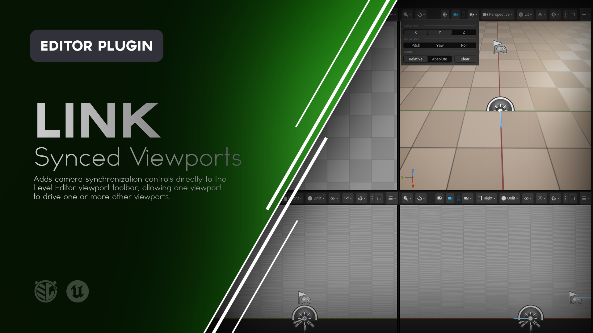

# Link

**Synchronize Unreal Engine Level Editor viewport cameras without forcing them into the same view.**

Link adds camera synchronization controls directly to the Level Editor viewport toolbar, allowing one viewport to drive one or more other viewports.

Use **Relative** mode to preserve existing camera offsets, **Absolute** mode to continuously match selected transform axes, or **Sync** for an immediate one-shot alignment.



---

## What is Link?

Unreal Engine supports several Level Editor viewports at the same time, which can be useful for:

- Level design
- Spatial alignment
- Composition
- Environment work
- Comparing an area from multiple angles
- Maintaining orthographic reference views
- Inspecting changes from several perspectives

Normally, each viewport camera moves independently.

Link allows those viewports to work together.

You define:

- One **Source** viewport
- One or more **Target** viewports
- Which position axes should synchronize
- Which rotation axes should synchronize
- Whether Targets follow relatively or match absolutely

For example, you might keep:

```text
Viewport 1 = Player perspective
Viewport 2 = Side perspective
Viewport 3 = Top orthographic
```

and navigate all three through the level by moving only Viewport 1.

Link does not create Camera Actors or modify your level.

It synchronizes the existing Level Editor viewport cameras.

---

# Features

### Source and Target Viewports

Assign one Level Editor viewport as the **Source** and any number of other Level Editor viewports as **Targets**.

Only one Source can exist at a time.

A viewport cannot be both Source and Target.

### Relative Linking

Targets follow the Source's movement while preserving their existing offsets.

This allows several viewpoints to move together without collapsing into the same camera position.

### Absolute Linking

Targets continuously match the Source on the enabled transform axes.

Axes that are not enabled remain independent.

### One-Shot Sync

Immediately copy the enabled Source transform axes to all valid Targets without changing your continuous Link mode.

### Independent Position Axes

Control synchronization independently for:

- X
- Y
- Z

### Independent Rotation Axes

Control synchronization independently for:

- Pitch
- Yaw
- Roll

Rotation synchronization applies to Perspective Targets.

### Multiple Targets

A single Source can drive several Target viewports simultaneously.

### Perspective and Orthographic Workflows

Perspective viewports can act as full transform Targets.

Orthographic viewports can follow Source position while retaining their projection orientation.

### Instant Enable / Disable

Suspend Link without clearing your Source, Targets, axes, or mode.

Re-enable it later without Targets suddenly catching up on movement that occurred while Link was disabled.

### Camera Lock Awareness

Link does not fight Level Editor viewports locked to Actors or cinematic cameras.

### PIE Protection

Viewport linking automatically suspends while Play In Editor is active.

### Native Level Editor Integration

Link controls live directly in Unreal Engine's Level Editor viewport toolbar.

### Editor Only

Link does not add runtime Actors, Components, gameplay systems, or packaged-game dependencies.

---
<!--
> [!IMPORTANT]
> **ATTENTION - README AUTHOR**
>
> This should be the main demonstration of Link.
>
> **Recommended visual:** GIF
>
> Use a three or four viewport layout.
>
> Show:
>
> 1. One Perspective viewport configured as Source.
> 2. Two other viewports configured as Targets.
> 3. Enable Link.
> 4. Navigate the Source viewport through the level.
> 5. Show both Targets moving with it while retaining their different viewing positions.
>
> Keep the movement deliberate and relatively slow so it is easy to watch all viewports simultaneously.
>
> Do not spend much of the GIF configuring Link. The important thing is seeing the resulting synchronized navigation.
>
> Around 8 to 12 seconds is ideal.
>
> **Suggested file:**
>
> `Doc/Images/Link-Relative.gif`
>
> Once captured, replace this callout with:
>
> ```markdown
> 
> ```
-->
---

# Using Link

Link controls appear in the Level Editor viewport toolbar beside Unreal Engine's camera controls.

Each viewport receives access to:

- **Sync**
- **Link**
- **Source / Target selectors**
- **Settings**

The Source and Target selectors apply specifically to the viewport whose toolbar you are using.

---

# Setting Up Multiple Viewports

Start by switching the Level Editor to a layout containing two or more viewports.

For example:

```text
┌───────────────────┬───────────────────┐
│                   │                   │
│   Perspective 1   │   Perspective 2   │
│                   │                   │
├───────────────────┼───────────────────┤
│                   │                   │
│       Top         │      Front        │
│                   │                   │
└───────────────────┴───────────────────┘
```

For normal Link operation, use a **Perspective viewport as the Source**.

Targets may be:

- Perspective
- Orthographic

---

# Choosing the Source

Each viewport toolbar contains an upper role selector.

Enable it to make that viewport the:

**Source**

Only one Source can exist at a time.

Choosing a new Source automatically replaces the previous Source.

If the viewport was previously a Target, assigning it as Source removes its Target role.

---

# Choosing Targets

The lower role selector assigns the current viewport as a:

**Target**

You may assign multiple Targets.

For example:

```text
Perspective 1     Source

Perspective 2     Target

Top               Target

Front             Target
```

If the current Source is changed into a Target, its Source role is cleared.

A viewport can never hold both roles simultaneously.
<!--
> [!IMPORTANT]
> **ATTENTION - README AUTHOR**
>
> Capture an annotated screenshot explaining the Link toolbar.
>
> **Recommended visual:** Screenshot
>
> Crop tightly around the upper-right viewport toolbar.
>
> Label:
>
> 1. Sync
> 2. Link
> 3. Source
> 4. Target
> 5. Settings
>
> If possible, show the Source selector active so the two role controls are visually easy to distinguish.
>
> **Suggested file:**
>
> `Doc/Images/Link-Controls.png`
>
> Once captured, replace this callout with:
>
> ```markdown
> 
> ```
-->
---

# Enabling Link

Click the **Link** button to enable continuous viewport synchronization.

When Link is enabled, movement from the Source is propagated to each valid Target according to the current:

- Position axes
- Rotation axes
- Relative / Absolute mode

Click **Link** again to suspend synchronization.

Disabling Link does not clear your setup.

The following remain configured:

- Source
- Targets
- Position axes
- Rotation axes
- Relative / Absolute mode

---

# Re-Enabling Link

Movement made while Link is disabled is intentionally ignored.

For example:

1. Enable Link.
2. Move the Source.
3. Targets follow.
4. Disable Link.
5. Move the Source somewhere else.
6. Targets remain stationary.
7. Enable Link again.

The Targets do **not** suddenly jump by the distance the Source moved while Link was disabled.

Link establishes a fresh movement baseline when it is re-enabled.

Use **Sync** if you want the Targets to immediately align with the Source again.

---

# Relative Mode

**Relative** is the default Link mode.

Relative mode applies Source camera movement **deltas** to the enabled Target axes.

This preserves the Target's existing spatial relationship to the Source.

For example:

```text
Initial Position

Source X = 0
Target X = 500
```

Move the Source:

```text
Source X = 100
```

The Target becomes:

```text
Target X = 600
```

The 500-unit offset remains intact.

The cameras move together without occupying the same position.

---

## Relative Rotation

The same concept applies to enabled rotation axes on Perspective Targets.

For example:

```text
Initial

Source Yaw = 0°
Target Yaw = 90°
```

Rotate the Source by:

```text
+30°
```

The Target becomes:

```text
Target Yaw = 120°
```

The Target retains its original 90-degree viewing offset.

---

# Why Use Relative Mode?

Relative linking is useful when each viewport serves a different purpose.

For example:

```text
Source          Main working camera

Target 1        Side perspective

Target 2        Rear perspective

Target 3        Top reference
```

As you move through the level, each viewport follows while preserving the view you originally established.

This is generally the most useful mode for coordinated multi-viewport navigation.

---

# Absolute Mode

**Absolute** mode continuously matches the Source values on the enabled axes.

For example:

```text
Source X = 100
Target X = 500
```

With Absolute X enabled:

```text
Target X = 100
```

The Target matches the Source X coordinate exactly.

---

## Disabled Axes Remain Independent

Absolute mode only affects axes you have enabled.

For example:

```text
Position

X = Enabled
Y = Enabled
Z = Disabled
```

The Target continuously matches:

```text
Source X
Source Y
```

while preserving its own:

```text
Target Z
```

This can be useful for maintaining a camera at a different height while keeping it spatially aligned in the horizontal plane.

---

## Changing Modes Does Not Move the Cameras

Switching between:

**Relative**

and:

**Absolute**

does not immediately move a Target.

The selected mode determines how Link responds the next time the Source camera moves.

Use **Sync** when you want an immediate alignment.
<!--
> [!IMPORTANT]
> **ATTENTION - README AUTHOR**
>
> Capture the difference between Relative and Absolute mode here.
>
> **Recommended visual:** GIF
>
> A split-screen multi-viewport layout is ideal.
>
> Show:
>
> 1. Two Perspective viewports starting at visibly different positions.
> 2. Relative mode enabled.
> 3. Move the Source and show the Target preserve its offset.
> 4. Switch to Absolute.
> 5. Move the Source again and show the enabled axes now match.
>
> Try to make the difference visually obvious rather than relying on camera coordinate readouts.
>
> **Suggested file:**
>
> `Doc/Images/Link-Relative-Absolute.gif`
>
> Once captured, replace this callout with:
>
> ```markdown
> 
> ```
-->
---

# Sync

The **Sync** button performs an immediate one-shot alignment.

Sync always performs an **absolute** copy of the currently enabled axes.

It does not matter whether continuous Link is currently configured as Relative or Absolute.

For example:

```text
Position

X = Enabled
Y = Enabled
Z = Disabled

Rotation

Pitch = Disabled
Yaw = Enabled
Roll = Disabled
```

Pressing Sync copies:

```text
X
Y
Yaw
```

from the Source to each valid Target.

The Target retains its existing:

```text
Z
Pitch
Roll
```

Sync does not change your Relative / Absolute mode.

---

# Sync and Relative Mode

Sync is especially useful together with Relative mode.

For example:

1. Assign Source and Target.
2. Enable all Position axes.
3. Press **Sync**.
4. Both cameras now occupy the same position.
5. Move the Target to the offset or viewing position you want.
6. Enable **Relative** mode.
7. Enable Link.

The Target now follows the Source while preserving the newly established offset.

---

# Position Axes

Open:

**Link Settings**

to choose which position axes participate in synchronization.

Available controls:

| Axis | Purpose |
|---|---|
| **X** | Synchronize world X position. |
| **Y** | Synchronize world Y position. |
| **Z** | Synchronize world Z position. |

By default:

```text
X = On
Y = On
Z = On
```

Each axis operates independently.

---

# Rotation Axes

Rotation controls are also available in Link Settings.

| Axis | Purpose |
|---|---|
| **Pitch** | Synchronize Perspective camera Pitch. |
| **Yaw** | Synchronize Perspective camera Yaw. |
| **Roll** | Synchronize Perspective camera Roll. |

By default:

```text
Pitch = Off
Yaw = Off
Roll = Off
```

Rotation synchronization applies only to **Perspective Targets**.

---

# Link Settings

Open the Settings button in any Link-enabled Level Editor viewport.

The menu contains:

### Position

```text
X
Y
Z
```

### Rotation

```text
Pitch
Yaw
Roll
```

### Mode

```text
Relative
Absolute
```

### Clear

Resets the current Link setup.
<!--
> [!IMPORTANT]
> **ATTENTION - README AUTHOR**
>
> Capture the Link Settings menu here.
>
> **Recommended visual:** Screenshot
>
> Make sure the complete menu is visible and includes:
>
> - X / Y / Z
> - Pitch / Yaw / Roll
> - Relative / Absolute
> - Clear
>
> Keep enough of the multi-viewport layout visible behind the menu to provide context.
>
> **Suggested file:**
>
> `Doc/Images/Link-Settings.png`
>
> Once captured, replace this callout with:
>
> ```markdown
> 
> ```
-->
---

# Clear

Click:

**Clear**

to restore Link to its default configuration.

Clear:

- Disables Link
- Removes the Source
- Removes all Targets
- Enables X
- Enables Y
- Enables Z
- Disables Pitch
- Disables Yaw
- Disables Roll
- Returns the mode to Relative

Clear does **not** move any viewport cameras.

---

# Orthographic Targets

Orthographic viewports can be used as Link Targets.

For example:

```text
Perspective     Source

Top             Target
Front           Target
```

Orthographic Targets can follow the Source's enabled position axes.

Their orthographic projection orientation remains unchanged.

This allows a Top viewport to remain a Top viewport while following the area being inspected in the Perspective Source.

---

## Orthographic Rotation

Rotation synchronization intentionally does not affect Orthographic Targets.

The following settings apply only to Perspective Targets:

- Pitch
- Yaw
- Roll

This prevents Link from fighting the fixed projection orientation of an Orthographic viewport.

---

## Orthographic Zoom

Link does not currently synchronize Orthographic zoom.

Only position is synchronized for Orthographic Targets.
<!--
> [!IMPORTANT]
> **ATTENTION - README AUTHOR**
>
> Capture the Perspective plus Orthographic workflow here.
>
> **Recommended visual:** GIF
>
> Use:
>
> - One Perspective Source
> - One Top Orthographic Target
> - One Front or Side Orthographic Target
>
> Move through the scene using the Perspective Source.
>
> Show both Orthographic viewports following the same area while keeping their fixed projection orientations.
>
> This is a very useful visual because it demonstrates a practical use for Link beyond simply mirroring multiple Perspective cameras.
>
> **Suggested file:**
>
> `Doc/Images/Link-Orthographic.gif`
>
> Once captured, replace this callout with:
>
> ```markdown
> 
> ```
-->
---

# Locked Viewports

Link respects Level Editor camera locks.

If a Target viewport is:

- Locked to an Actor
- Locked to a cinematic camera

Link skips that Target instead of forcibly moving it.

If the Source viewport becomes locked, continuous Link synchronization is suspended until the Source becomes usable again.

This prevents Link from fighting Unreal Engine's existing camera-lock workflows.

---

# Play In Editor

Link is an editor navigation tool.

Synchronization automatically suspends while **Play In Editor** is active.

Link does not:

- Drive gameplay cameras
- Move PIE viewports
- Modify runtime camera behavior

When the editor returns to its normal editing state, Link can resume from a fresh Source movement baseline.

---

# Multiple Targets

There is no single-Target restriction.

A Source can drive several Targets at once.

For example:

```text
Perspective 1       Source

Perspective 2       Target
Perspective 3       Target
Top                 Target
```

Each Target maintains its own transform on axes not controlled by Link.

In Relative mode, each Target also preserves its own independent offset from the Source.

This means several Targets can follow the same Source while each provides a completely different view of the scene.

---

# Example Workflows

## Maintain a Side View While Navigating

1. Open two Perspective viewports.
2. Position the second viewport at a useful side angle.
3. Assign the first viewport as Source.
4. Assign the second as Target.
5. Enable X, Y, and Z.
6. Leave rotation disabled, or enable Yaw if desired.
7. Choose **Relative**.
8. Enable Link.

The side viewport follows your movement while maintaining its existing offset and viewing angle.

---

## Keep Top and Side References With You

1. Create a layout containing Perspective, Top, and Side viewports.
2. Use Perspective as Source.
3. Set Top and Side as Targets.
4. Enable X, Y, and Z.
5. Leave rotation disabled.
6. Choose Relative mode.
7. Enable Link.

Navigate through the level from Perspective.

The Orthographic reference views follow the area you are working on.

---

## Match Horizontal Position but Preserve Height

Enable:

```text
X
Y
```

Disable:

```text
Z
```

Use Absolute mode.

Targets continuously match the Source horizontally while retaining their own vertical positions.

---

## Follow Position but Preserve Viewing Direction

Enable:

```text
X
Y
Z
```

Disable:

```text
Pitch
Yaw
Roll
```

Use Relative mode.

Targets follow the Source through the level while keeping their own viewing orientation.

---

## Follow Position and Turning

Enable:

```text
X
Y
Z
Yaw
```

Leave:

```text
Pitch
Roll
```

disabled.

Relative mode allows a Perspective Target to follow both Source movement and horizontal turning while preserving its relative viewing offset.

---

## Align, Then Establish an Offset

1. Assign Source and Target.
2. Enable the desired axes.
3. Press **Sync**.
4. Move the Target into the secondary viewpoint you want.
5. Choose Relative.
6. Enable Link.

Both viewports begin from a known alignment before the Target receives its working offset.

---

# Session State

Link configuration is intentionally lightweight editor-session state.

The current:

- Source
- Targets
- Link enabled state
- Position axes
- Rotation axes
- Relative / Absolute mode

are not saved as project or level data.

Restarting Unreal Editor begins with Link's default configuration.

The viewport cameras themselves continue to use Unreal Engine's normal viewport behavior.

---

# Installation

Link can be installed through **Fab**, from a **precompiled GitHub Release**, or directly from the **GitHub source**.

For most users, the Fab or GitHub Release installation is recommended.

---

## Fab / Epic Games Launcher

> **Availability:** Use this installation method once Link is available through Fab.

1. Add **Link** to your library on Fab.
2. Open the **Epic Games Launcher**.
3. Navigate to your Unreal Engine Library.
4. Locate Link in your Fab / Vault library.
5. Install Link to the supported Unreal Engine version.
6. Launch your Unreal Engine project.
7. Open **Edit > Plugins**.
8. Search for **Link**.
9. Enable the plugin if it is not already enabled.
10. Restart Unreal Editor if prompted.

Once enabled, Link controls appear in the Level Editor viewport toolbar.

---

## GitHub Release

This is the easiest manual GitHub installation method because the release package is already prepared for the supported Unreal Engine version.

### 1. Download Link

Open the repository's **Releases** page.

Download the packaged plugin matching your Unreal Engine version and platform.

For the 1.0.0 release, use the package built for:

```text
Link 1.0.0
Unreal Engine 5.8.3
Windows 64-bit
```

A packaged release should use a name similar to:

```text
Link-v1.0.0-UE5.8.3-Win64.zip
```

Do not use GitHub's automatically generated **Source code** ZIP as a precompiled plugin package.

### 2. Close Unreal Editor

Close the project before installing the plugin.

### 3. Locate Your Project Plugins Folder

Your project should contain a `Plugins` directory beside the `.uproject` file:

```text
YourProject/
├── Config/
├── Content/
├── Plugins/
└── YourProject.uproject
```

If the `Plugins` directory does not exist, create it.

### 4. Extract Link

Extract the `Link` folder into:

```text
YourProject/Plugins/
```

The final structure should look similar to:

```text
YourProject/
├── Plugins/
│   └── Link/
│       ├── Config/
│       ├── Resources/
│       ├── Source/
│       └── Link.uplugin
└── YourProject.uproject
```

### 5. Launch the Project

Open your Unreal Engine project.

If necessary, navigate to:

**Edit > Plugins**

Search for:

```text
Link
```

Enable the plugin and restart Unreal Editor if prompted.

---

## GitHub Source

Developers who want the source or want to modify Link can clone the repository directly.

### Requirements

Building Link from source requires a working Unreal Engine C++ development environment.

For Windows this generally means:

- Unreal Engine 5.8.x
- Visual Studio with the appropriate C++ workloads
- A project capable of compiling C++ plugins

### Clone the Repository

Close Unreal Editor and navigate to your project's `Plugins` directory.

```bash
cd YourProject/Plugins
git clone https://github.com/mippi-the-dork/Link.git
```

Your project should now contain:

```text
YourProject/Plugins/Link/
```

### Generate Project Files

If necessary:

1. Right-click your `.uproject`.
2. Select **Generate Visual Studio project files**.

Then open the generated solution and build your project's Editor target.

For example:

```text
YourProjectEditor
Win64
Development Editor
```

Launch the project after compilation completes.

---

# Updating Link

## GitHub Release Installation

When updating a manually installed release:

1. Close Unreal Editor.
2. Remove the existing `Plugins/Link` folder.
3. Extract the new Link release into the `Plugins` directory.
4. Reopen the project.

Replacing the complete plugin folder is recommended rather than copying individual files over an older version.

Because Link configuration is session state, there is no saved Link setup inside the plugin folder that needs to be migrated.

---

## Git Source Installation

If you cloned the repository using Git:

```bash
cd YourProject/Plugins/Link
git pull
```

Rebuild the project if the source has changed.

---

# Compatibility

The current Link release targets:

| | |
|---|---|
| **Link Version** | 1.0.0 |
| **Unreal Engine** | 5.8.3 |
| **Platform** | Windows 64-bit |
| **Plugin Type** | Editor |
| **Runtime Dependency** | None |
| **Runtime Actors** | None |
| **Runtime Components** | None |
| **Packaged Game Impact** | None |

Link is currently configured as a Win64 editor plugin.

Compatibility with additional Unreal Engine versions or platforms should not be assumed unless explicitly listed in a release.

---

# How Link Works

Link integrates directly into Unreal Engine's Level Editor viewport toolbar.

Each Level Editor viewport is tracked using its viewport configuration identity.

When continuous Link is enabled:

1. Link identifies the configured Source viewport.
2. The Source must be a valid Perspective Level Editor viewport.
3. Link samples the Source camera position and rotation.
4. The new transform is compared against the previous sample.
5. In Relative mode, the resulting movement delta is applied to enabled Target axes.
6. In Absolute mode, enabled Target axes are assigned the Source values.
7. Rotation is applied only to Perspective Targets.
8. Updated Targets are redrawn.

Link guards against its own Target updates feeding back into synchronization.

When Link is disabled, its Source movement sample is cleared.

This is why re-enabling Link does not apply movement that occurred while synchronization was suspended.

The **Sync** command uses the same axis settings but performs an immediate absolute copy instead of continuous synchronization.

---

# What Link Does Not Do

Link is an **editor viewport navigation utility**, not a runtime camera system.

It does not:

- Create Camera Actors
- Move level Actors
- Modify Actor transforms
- Modify level geometry
- Control gameplay cameras
- Add runtime Components
- Add runtime systems
- Affect packaged games
- Synchronize Orthographic rotation
- Synchronize Orthographic zoom
- Override camera-locked viewports
- Replace Unreal Engine's viewport layout system
- Save Source and Target configuration into the level
- Modify engine source

Link operates entirely on Level Editor viewport cameras.

---

# Limitations

### Perspective Source Required

The active Source must be a Perspective Level Editor viewport.

Orthographic viewports can currently be Targets, but not active Sources for Link propagation or Sync.

### Orthographic Rotation

Orthographic Targets retain their projection orientation.

Pitch, Yaw, and Roll synchronization applies only to Perspective Targets.

### Orthographic Zoom

Orthographic zoom is not synchronized.

### Camera-Locked Viewports

Viewports locked to Actors or cinematic cameras are skipped.

Link does not override Unreal Engine's normal viewport camera-lock behavior.

### Session State

Link configuration is not currently persisted between Unreal Editor sessions.

Restarting the editor restores:

```text
Link = Disabled

Source = None
Targets = None

Position:
X = On
Y = On
Z = On

Rotation:
Pitch = Off
Yaw = Off
Roll = Off

Mode = Relative
```

### Level Editor Only

Link targets standard Unreal Engine Level Editor viewports.

Asset Editor viewports and other specialized viewport types are outside its current scope.

---

# Troubleshooting

## Link Does Not Appear in the Viewport Toolbar

Check:

**Edit > Plugins**

Search for:

```text
Link
```

Confirm that the plugin is enabled.

Restart Unreal Editor if the plugin was just enabled.

Make sure you are looking at a standard **Level Editor viewport**.

---

## Sync Is Disabled

Sync requires:

- A valid Perspective Source
- At least one Target
- No active Play In Editor session
- A Source that is not locked to an Actor
- A Source that is not locked to a cinematic camera

Check those conditions before trying Sync again.

---

## A Target Is Not Moving

Check that:

- Link is enabled
- A Source is assigned
- The viewport is assigned as a Target
- At least one relevant axis is enabled
- The Source is Perspective
- The Target is not camera-locked
- Play In Editor is not active

---

## Rotation Is Not Affecting a Target

Make sure at least one rotation axis is enabled:

```text
Pitch
Yaw
Roll
```

Also confirm the Target is a **Perspective viewport**.

Rotation synchronization intentionally does not affect Orthographic Targets.

---

## An Orthographic Target Is Not Rotating

This is expected.

Orthographic Targets retain their normal fixed projection orientation.

Only position synchronization applies to Orthographic Targets.

---

## Orthographic Zoom Is Not Changing

Link does not currently synchronize Orthographic zoom.

This is separate from the viewport's world position.

---

## Re-Enabling Link Does Not Catch Up to the Source

This is intentional.

Movement performed while Link was disabled is ignored.

Re-enabling Link creates a new Source movement baseline.

Use **Sync** if you want the Targets to immediately align to the Source.

---

## Absolute Mode Did Not Move the Target Immediately

Changing from Relative to Absolute does not move cameras by itself.

Absolute mode affects what happens when the Source camera next changes.

Use **Sync** if you want immediate alignment.

---

## Changing an Axis Did Not Immediately Move the Target

Axis settings determine which values participate in subsequent Link movement or Sync.

Changing an axis checkbox does not itself reposition the Target.

Use **Sync** if you want the newly enabled axes copied immediately.

---

## A Camera-Locked Target Is Not Moving

This is intentional.

Link skips viewports locked to Actors or cinematic cameras rather than overriding Unreal Engine's existing camera controls.

Unlock the Target if you want Link to move it.

---

## Link Stops During PIE

This is expected.

Link suspends synchronization while Play In Editor is active.

It is designed for Level Editor navigation rather than runtime camera control.

---

# Reporting Bugs

If you encounter a problem, please open an issue in the Link GitHub repository.

When reporting a bug, include:

- Link version
- Unreal Engine version
- Windows version
- Whether Link was installed from Fab, a GitHub Release, or source
- Viewport layout
- Which viewport was Source
- Which viewports were Targets
- Whether the Targets were Perspective or Orthographic
- Relative or Absolute mode
- Enabled Position axes
- Enabled Rotation axes
- Whether any viewport was camera-locked
- Steps to reproduce the problem
- Screenshots or video when relevant
- Any relevant Unreal Editor log output

For synchronization problems, a short screen recording of the complete viewport layout is especially useful.

---

# Feature Requests

Suggestions and feature requests are welcome through GitHub Issues.

When proposing a feature, describe the multi-viewport workflow or navigation problem you're trying to solve rather than only the implementation you would like to see.

That makes it easier to determine whether the feature belongs in Link and whether there may be a simpler solution.

---

# Contributions

Pull requests are welcome.

If you're considering a significant change, opening an Issue first is recommended so the intended behavior can be discussed before substantial work is done.

Link is intended to remain focused on coordinated Level Editor viewport navigation.

---

# License

Link is distributed under the **MIT License**.

See [`LICENSE`](LICENSE) for details.

---

# About

Link is an Unreal Engine editor utility created by **Mippi the Dork**.

The plugin was built around a simple idea:

> Multiple viewports are more useful when they can work together without all becoming the same view.

Link keeps each viewport useful on its own while allowing one camera to coordinate the rest.
